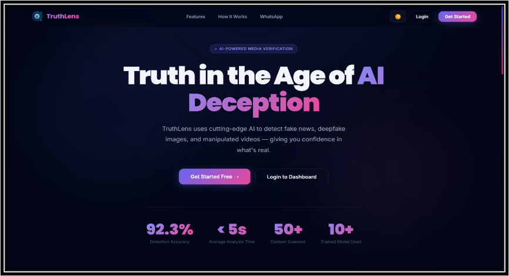

# TruthLens AI – Deepfake & Manipulated Media Detector

TruthLens AI is a full-stack AI-powered web application that detects fake and manipulated content across text, images, and videos using Machine Learning and Deep Learning models.

## 🚀 Features
- 🔐 JWT-based Authentication System
- 📰 Fake News Detection using NLP
- 🖼 Deepfake Image Detection
- 🎥 Deepfake Video Analysis
- 📱 Twilio Integration
- 🌐 Responsive Full-Stack Web App

## 🛠 Tech Stack

### Frontend
- React.js
- Vite
- Tailwind CSS

### Backend
- Node.js
- Express.js
- MongoDB Atlas

### AI/ML
- FastAPI
- HuggingFace Transformers
- PyTorch
- OpenCV

## 🧠 AI Models Used
- `facebook/bart-large-mnli` for text classification
- `prithivMLmods/deepfake-detector-model-v1` for deepfake detection

## 📸 Screenshots

### Landing Page

  

## 🌐 Live Demo
- Live Link: https://truthlens001.netlify.app

## 📚 Key Learnings
- Full-stack development
- AI model integration
- REST API architecture
- JWT authentication
- Deepfake detection systems
- Cloud deployment

## 👨‍💻 Author
**Dhruv Mahajan**

LinkedIn: https://www.linkedin.com/in/dhruv-mahajan6969/
GitHub: https://github.com/dhruvmahajan001
